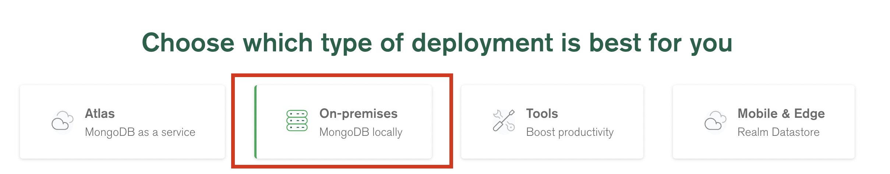
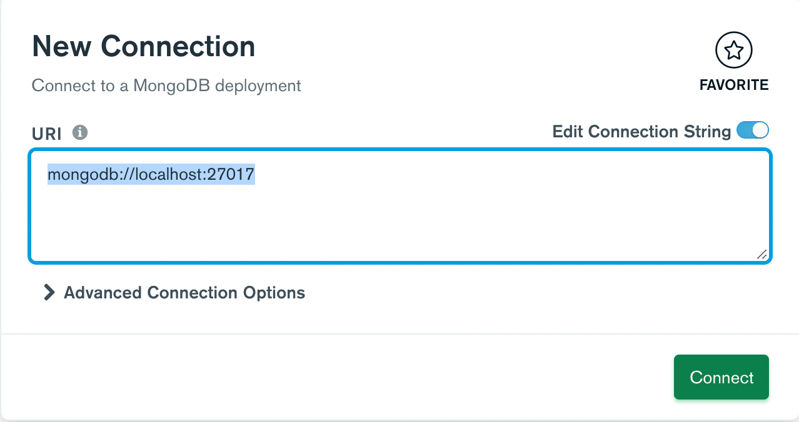

<p align="center">
  <a href="" rel="noopener">
 </a>
</p>

<h3 align="center">RESTful API</h3>

<div align="center">

[]()
[](https://github.com/kylelobo/The-Documentation-Compendium/issues)
[](https://github.com/kylelobo/The-Documentation-Compendium/pulls)
[](/LICENSE)

</div>

---

<p align="center"> Projet certifiant des étudiants de Castres.
    <br> 
</p>

## Sommaire

- [📝 Sommaire](#-table-of-contents)
- [🛫 Pour commencer](#-about-)
  - [🪡 Prérequis](#-getting-started-)
  - [🖥️ Installation](#prerequisites)
- [🙆🏾 A vos marques...]()
- [🤖 Tests](#installing)
  - [🛠️ Tests end to end](#-running-the-tests-)
  - [💎 Coding style]()
- [🏃 Usage]()
- [🚀 Deploiment]()
- [🧱 Technologies]()
- [👷🏾 Auteurs]()
- [🎉 Remerciement]()
- [🔜 La suite ?]()

## Pour commencer <a name = "about"></a>

Ce projet à pour but d'encadrer la partie back-end du projet certifiants. Avec une API permettant **la connexion** et **l'historique de connexion**.

## Prérequis <a name = "getting_started"></a>

Vous pouvez clonez ce repos pour avoir le projet :
```bash
  git clone https://
```

où suivre ce ***README*** qui vous explique en détails comment procéder.

- [Postman](https://www.postman.com/downloads/)
- [IDE](https://code.visualstudio.com/)
- [Web browser](https://www.youtube.com/watch?v=dQw4w9WgXcQ&ab_channel=RickAstley)
- [NPM](https://docs.npmjs.com/downloading-and-installing-node-js-and-npm)
- [NodeJs](https://nodejs.org/en/)
- [MongoDB](https://www.mongodb.com/try/download/community?tck=docs_server)
- [Typescript](https://www.npmjs.com/package/ts-node)

### Installation

Pour installer mongoDB, ***suivez ses étapes*** :

1. Allez sur ce lien : [MongoDB](https://www.mongodb.com/try/download/community?tck=docs_server).
2. Télécharger la version ***locale*** et le format ***msi***.
3. <p align="center">
  <a href="" rel="noopener">
 </a>
</p>
4. Pour gérer vos bases de données plus facilement, télécharger Studio 3T.

### À vos marques...

Créer un répertoire au nom de *ment*. Qui est l'acronyme des technologies que l'on va utiliser : MongoDB, Express, Node, TS.

```bash
  mkdir ment
```

Ouvrez ce répertoire avec VSCode. Votre répertoire sera vide.

Exécuter la commande pour créer un projet node.

***Vérifier bien que votre version de node soit en 18 !!!***

```bash
  npm init
```

ou 

```bash
  yarn init
```

et remplissez les données de votre projet.

Voilà à quoi ressemble votre projet :

<p align="center">
  <a href="" rel="noopener">
 </a>
</p>

Installer les dépendances suivantes :

```bash
  npm install express zod config cors mongoose pino pino-pretty dayjs bcrypt jsonwebtoken lodash nanoid
```

Nous allons voir en à quoi correspondent **chacune de ces dépendances**.  

Installer maintenant les ***dépendances dev*** qui ne seront pas utiles à la production mais nécessaires au bon développement de notre app.

```bash
  npm i @types/body-parser @types/config @types/cors @types/express @types/node @types/pino @types/mongoose @types/bcrypt @types/jsonwebtoken @types/lodash @types/nanoid ts-node-dev typescript -D
```

Créer un répertoire *src* à la racine de votre projet.

```bash
  mkdir src
```

Déplacer vous dans le répertoire src.

```bash
  cd src
```

Créer un fichier *app.ts*.

```bash
  touch app.ts
```

Faites un console.log dans le app.ts.

```ts
  console.log('never gonna give you up')
```

Pour lancer le app.ts, créer un script dans votre package.json.

```json
  "script":{
    "dev":"ts-node-dev --respawn --transpile-only src/app.ts"
  },
```


### Prêt ?

Commencer par importer express.

```ts
  import express from 'express';
```

Créer une constante est lancer votre serveur sur le port de votre choix. Ce port est en dure mais sera mis dans nos variables d'environement.


```ts
  const APP = express();

  APP.listen(3000, ()=>{
    console.log("🚀 App is running")
  })
```

***ATTENTION ! Si vous avez une erreur à ce stade, vous n'avez probablement pas rajouter ceci dans votre package.json***

```json
  "outDir":"build"
```

Vous devriez avoir un message dans votre terminal.

Maintenant, nous allons setup nos variables d'environnement.

Créer un dossier config à la racine du projet.

***ATTENTION ! Vérifier bien que vous êtes à la racine avant d'exécuter la commande***

```bash
  mkdir config
```

Dans le dossier config créer un fichier default.ts.

```bash
  cd config && touch default.ts
```

Dans le fichier :

```ts
  export default {
    port:  <port_de_votre_choix>
  }
```

Revenez dans le app.ts et importer config.

```ts
  import config from 'config'
```

Pour utiliser le port :

```ts
  const PORT = config.get('port')
```

Nous allons utiliser le TS pour pouvoir typé nos variables et ainsi rendre notre application plus sûr.

```ts
const PORT = config.get<number>('port')
```

Il vous suffit de remplacer le port en dur dans le code par votre constante.

```ts
  app.listen(port, ()=>{
    console.log()
  })
```

## Partez !

Attaquons nous maintenant à la base de données utilisateurs. Créer un dossier database ***à la dans votre dossier src de votre projet***.

Il est impérative de vérifier que votre serveur mongo tourne. Exécuter la commande suivante :

```bash
mongod
```

```bash
  mkdir database && cd database
```

Créer un fichier qui nous servira d'interface de connexion à notre base de données mongoDB.

```bash
  touch mongodb.ts
```

Importer l'ODM (Object Data Modeling) mongoose dans mongodb.ts et config.

```ts
  import mongoose from 'mongoose';
  import config from 'config';
```

Déclarer et exporter la fonction connect.

```ts
  function connect() {
    //code here
  }

export default connect;
```

Installer également [mongoDB compass](https://www.mongodb.com/try/download/compass), une bonne alternative à studio 3T pour manager vos BDD.
Vous pouvez obtenir votre uri de base de donnée avec mongoDB compass, vous devez simplement rajouter le nom de votre db.


<p align="center">
  <a href="" rel="noopener">
 </a>
</p>

Compléter votre fonction afin d'initialiser une connection à votre base de donnée mongoDB.

```ts
  async function connect() {
    const DBURI = 'mongodb://localhost:27017/ment_user';

    try {
      await mongoose.connect(DBURI)
      console.log('Connected to mongoDB')
    }
    catch(error:any) {
      console.log('Could not connect to mongoDB')
      process.exit(-1)
    }  
  }
```

Une fois la fonction crée, exportez-la vers ***app.ts*** et appeler la dans le *listen*.

```ts
  import connect from '../database/mongodb';

  app.listen(port, async () => {
    console.log('App is running')
    await connect();
  })
```

Une fois que cela fonctionne, ***passez par le config*** pour obtenir l'URI de votre base de donnée. Comme vous l'avez fait pour le port. Remplacer cette ligne  dans le dossier mongodg.ts:

```ts
  const DBURI = "mongo://localhost:27017/db_name"
```

par 

```ts
  const DBURI = config.get<string>('mongodburi')
```

Vous obtiendrez ceci :

```ts
  import mongoose from 'mongoose'
  import config from 'config'

  async function connect() {
    const DBURI = config.get<string>('mongodburi')

    try {
      //connect
    }
    catch(error:any){
      //error
    }
  }
```

## Place au logger

On utilise pas mal de console log dans notre projet, ce qui n'est pas une mauvaise chose mais on peut améliorer cela.

Dans le dossier src de votre projet, créer un dossier *utils*

```bash
  mkdir utils && cd utils
```

Créer un fichier logger.ts

```bash
  touch logger.ts
```

Importer logger depuis le package *pino*. Puis dayjs depuis *dayjs*

```ts
  import logger from 'pino'
  import dayjs from 'dayjs'
```

Nous allons créer notre premier logger grâce à ces deux packages. Dayjs nous permet de manipuler la date plus facilement tandis que pino est notre logger.

```ts
  const LOG = logger({  
    base: {
      pid: false
    },
    timestamp: () => `,"time":"${dayjs().format()}"`
  })

  export default LOG
```

Importer le dans le *app.ts* et remplacer votre console.log.

```ts
  .
  .
  .
  import LOG from './utils/logger.ts'
  .
  .
  LOG.info(`🚀 App is running at http://localhost:${PORT}`)
  LOG.error(`🔥 App is crashing`)
```

***Remplacer tous vos console.log par  des logger !***

## Toutes les routes mène à ROM

Il est temps de designer notre API. ***Dans le dossier src du projet***, créer un dossier *routes*.

```bash
  mkdir routes && cd routes
```

Les routes sont groupés par leurs niveaux d'accès : public et privée. Créer deux sous-dossier ./routes/public et .routes/private.

```bash
  mkdir public && mkdir private
```

Ensuite créer un fichier dans le dossier public.

```bash
  cd public && touch openRoutes.ts
```

Ensuite créer l'équivalent dans le dossier private.

```bash
  cd .. cd private && privateRoutes.ts
```

Le dossier routes va nous permettre de rediriger les requêtes HTTP vers le controlleur.

Dans le dossier public dans le fichier , créer la function openRoutes().

```ts
  export function openRoutes() {
    //code here
  }
```

La fonction *openRoutes* prend en paramètre une app de type **Express**.

```ts
  import { Express } from 'express';
  
  function openRoutes(app: Express){

  }
```

Exporter la function dans ***app.ts*** et vérifier qu'il n'y ai pas d'erreur.

```ts
  //dans le listen
  openRoutes(app)
```

Dans ***app.ts***, importer openRoutes.

Formater un votre app.ts à l'aide d'un try catch de sorte que dès lors où vous avez une erreur, cela renvoie une erreur.

Nous allons donc développer notre première endpoint dans ***./routes/public***.

```ts
  import {Request, Response } from 'express'
  app.get('/healthcheck', (req: Request, res: Response)=>{
    res.status(200).send({'message': '✅'})
  })
```

Avant de créer plus d'endpoint, nous allons créer notre premier ***middleware***. 

Dans le dossier ***src***, créer un dossier validate, puis créer un fichier validateRessource.ts.

```bash
  mkdir validate && cd validate && touch valdiateRessource.ts
```

Ce middleware va nous valider nos requêtes. Par exemple, lorsque nous allons envoyer un utilisateur, faire en sorte que les données envoyées par l'utilisateur soit cohérent. Pour ça, nous allons utiliser [Zod](https://www.npmjs.com/package/zod).

```ts
  import { AnyZodObject } from 'zod'
  import { Request, Response, NextFunction } from 'express'

  const validate = (schema: AnyZodObject) => (req: Request, res:Response, next:NextFunction) => {
    try {
      schema.parse({
        body: req.body,
        query: req.query,
        params: req.params
      })
    } catch(error:any){
      return res.status(400).send(error.error)
    }
  }
  export default validate;
```

cette fonction prend en paramètre un schema et regarde si tout les champs correspondent.

## Inscription utilisateur

Pour créer des utilisateurs, il faut les modéliser en base de données.

Créer dans le dossier src, un dossier *models*.

```bash
    mkdir models && cd models
```

Puis créer un fichier user.model.ts.

```bash
  touch user.model.ts
```


## 🔧 Running the tests <a name = "tests"></a>

Explain how to run the automated tests for this system.

### Break down into end to end tests

Explain what these tests test and why

```
Give an example
```

### And coding style tests

Explain what these tests test and why

```
Give an example
```

## 🎈 Usage <a name="usage"></a>

Add notes about how to use the system.

## 🚀 Deployment <a name = "deployment"></a>

Add additional notes about how to deploy this on a live system.

## ⛏️ Built Using <a name = "built_using"></a>

- [MongoDB](https://www.mongodb.com/) - Database
- [Express](https://expressjs.com/) - Server Framework
- [VueJs](https://vuejs.org/) - Web Framework
- [NodeJs](https://nodejs.org/en/) - Server Environment

## ✍️ Authors <a name = "authors"></a>

- [@kylelobo](https://github.com/kylelobo) - Idea & Initial work
- [EmericBayard]()

See also the list of [contributors](https://github.com/kylelobo/The-Documentation-Compendium/contributors) who participated in this project.

## 🎉 Acknowledgements <a name = "acknowledgement"></a>

- Hat tip to anyone whose code was used
- Inspiration
- References